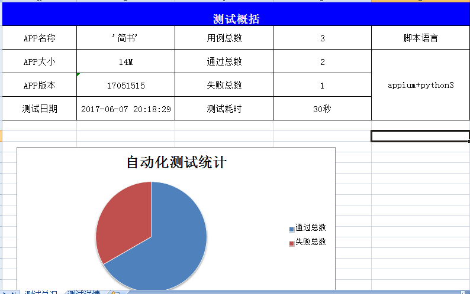
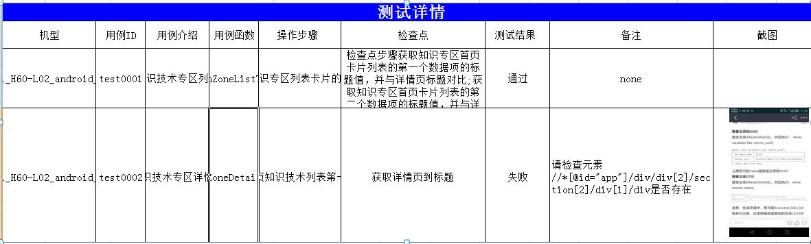

# project and introduction
* automated testing framework based on appium+python3 

# outline
* python3
* unittest  parameterization
* objectpage
* testcase use YMAL
* excel show report
* multi device Andoird parallel

# project package
* Base
* Log logs of operating cases for different devices, and screenshots of failed operations
* PageObject 
* test
* runner 


# configure


# Example - first boot app


**configure yaml**

```
testinfo:
    - id: test001
      title: first open app
testcase:
    - operate_type: swipeLeft
      time: 4
      element_info: android.widget.ImageView
      find_type: class_name
    - element_info: com.jianshu.haruki:id/tv_enter
      find_type: id
      operate_type: click
check:
    - element_info: com.jianshu.haruki:id/btn_login
      find_type: id
```


**PageObject**

```
class FirstOpen:
    '''
    kwargs: WebDriver driver, String path
    isOperate: The operation failed and the checkpoint failed
    testInfo：
    testCase：
    '''

    def __init__(self, **kwargs):
        self.driver = kwargs["driver"]
        self.path = kwargs["path"]
        self.operateElement = OperateElement(self.driver)
        self.isOperate = True
        self.testInfo = getYam(self.path)["testinfo"]
        self.testCase = getYam(self.path)["testcase"]


    '''
    operate steps
    logTest logger
    '''

    def operate(self, logTest):
        for item in self.testCase:
            result = self.operateElement.operate(item, self.testInfo, logTest)

            if not result:
                self.isOperate = False
                break

    '''
    checkpoint
    caseName
    logTest 
    '''

    def checkPoint(self, caseName, logTest, devices):
        result = False
        if not self.isOperate:
            print("he operation failed and the checkpoint failed")
            # return self.isOperate
        else:
            check = getYam(self.path)["check"]
            result = self.operateElement.findElement(check)

        countSum(result)
        countInfo(result=result, testInfo=self.testInfo, caseName=caseName, driver=self.driver, logTest=logTest, devices=devices)
        return result

```


**test**

```
PATH = lambda p: os.path.abspath(
    os.path.join(os.path.dirname(__file__), p)
)


class FirstOpenTest(ParametrizedTestCase):
    def testFirst(self):
        firsOpen = FirstOpen(driver=self.driver, path=PATH("../yaml/firstOpen.yaml"))
        firsOpen.operate(logTest=self.logTest)
        firsOpen.checkPoint(caseName=self.__class__.__name__, logTest=self.logTest, devices=self.devices["deviceName"])
		

    def setUp(self):
        super(FirstOpenTest, self).setUp()
```


# main funciton code

- runner.py

```
def runnerCaseApp(devices):
    starttime = datetime.now()
    suite = unittest.TestSuite()
    suite.addTest(ParametrizedTestCase.parametrize(FirstOpenTest, param=devices)) # Reference different testcase classes
    suite.addTest(ParametrizedTestCase.parametrize(LoginTest, param=devices))
    unittest.TextTestRunner(verbosity=2).run(suite)
    endtime = datetime.now()
    countDate(datetime.now().strftime('%Y-%m-%d %H:%M:%S'), str((endtime - starttime).seconds)
	
	...
	
	
if __name__ == '__main__':
    devicess = AndroidDebugBridge().attached_devices()
    if len(devicess) > 0:
        l_devices = []
        init()
        for devices in devicess:
            app = {}
            port = random.randint(4700, 4900)
            bpport = random.randint(4700, 4900)
            app["port"] = str(port)
            app["devices"] = devices
            l_devices.append(app)
            appium_server = AppiumServer(port=port, bport=bpport, devices=devices)
            appium_server.start_server()
            while not appium_server.is_runnnig():
                time.sleep(2)
        runnerPool(l_devices)
        stopAppiumMacAndroid(l_devices)
        writeExcel()
    else:
        print("没有可用的安卓设备")
```

## run command

```
python runner.py
```


# show report

**log**

samsung_GT-I9500_android_4.4，screenshot

```
2017-06-07 19:39:35,972  - INFO - ----  test001_FirstOpenTest_android.widget.ImageView   START     ----
2017-09-23 17:28:26,074  - INFO - [CheckPoint_1]: TechZoneDetailTest_请检查元素//*[@id="app"]/div/div[2]/section[2]/div[1]/div是否存在: NG
........

```

**excel report**






# other
* [Chinese](Chinese.md)


